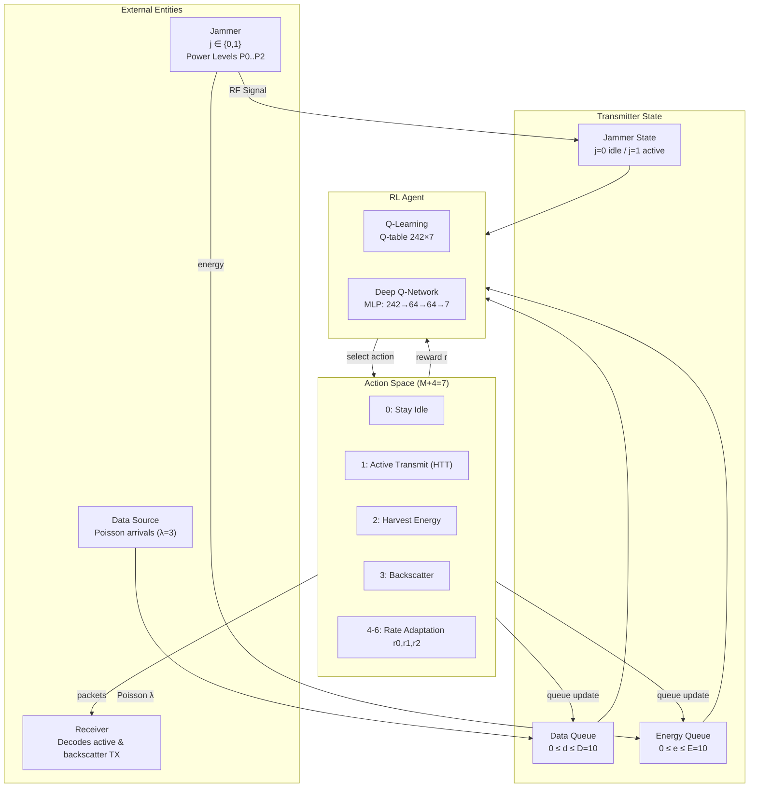
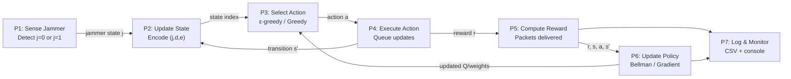

# System Architecture

> Ambient Backscatter Anti-Jamming via Reinforcement Learning  
> *Based on: N. Van Huynh et al., IEEE Wireless Commun. Letters, 2019*

---

## 1. High-Level System Overview

This project implements a reinforcement learning-based framework for anti-jamming wireless communication using ambient backscatter and energy harvesting. The system consists of three main physical components:
- A Transmitter that learns to choose optimal actions
- A Receiver that gets data packets
- A Jammer that randomly switches between idle and active states

The transmitter has two key capabilities:
1. **Ambient Backscatter**: Reflect and modulate the jammer's RF signal to transmit data packets when the jammer is active
2. **Energy Harvesting**: Harvest energy from the jammer's RF signal when the jammer is active, to store in an energy queue for later use

The system operates in discrete time slots. In each slot:
1. The transmitter observes the current environment state
2. The RL agent selects an action
3. The action is executed, and a reward is received
4. The environment transitions to the next state

```
┌─────────────────────────────────────────────────────────────────────┐
│                        Physical Layer                               │
│                                                                     │
│   [Data Source]──→[Transmitter]──────────────→[Receiver]           │
│        (Poisson λ)   │  ↑ backscatter/reflect                      │
│                      │  │                                           │
│               [Jammer RF Signal]                                    │
│                   (j=0/1, power P)                                  │
└─────────────────────────────────────────────────────────────────────┘
                              │
                              ▼
┌─────────────────────────────────────────────────────────────────────┐
│                   Decision / Learning Layer                         │
│                                                                     │
│   State (j, d, e) ──→ RL Agent (Q / DQN) ──→ Action              │
│        ↑                                         │                  │
│        └──────────── Reward r(s,a) ◄────────────┘                  │
└─────────────────────────────────────────────────────────────────────┘
```

---

## 2. Component Architecture

Below is a detailed breakdown of all system components and their interactions:



### External Entities
- **Jammer**: Interferes with communication, has two states (idle/active) and three power levels when active
- **Data Source**: Generates packets according to a Poisson process with arrival rate λ=3
- **Receiver**: Receives and decodes data packets from the transmitter

### Transmitter State
- **Data Queue (d)**: Stores incoming data packets, maximum capacity D=10
- **Energy Queue (e)**: Stores harvested energy for active transmission, maximum capacity E=10
- **Jammer State (j)**: Observed state of the jammer (0=idle, 1=active)

---

## 3. Data Flow Diagram (Level 0 — Context)

This high-level context diagram shows the system as a single process interacting with external entities:

```
 ┌──────────┐    jamming signal    ┌─────────────────────────────┐
 │  Jammer  │─────────────────────▶│                             │
 └──────────┘                      │   Anti-Jamming Transmitter  │
                                   │   System (MDP + RL Agent)   │
 ┌──────────┐    data packets      │                             │
 │   Data   │─────────────────────▶│                             │
 │  Source  │                      │                             │
 └──────────┘                      └──────────────┬──────────────┘
                                                  │ transmitted packets
                                                  ▼
                                          ┌──────────────┐
                                          │   Receiver   │
                                          └──────────────┘
```

---

## 4. Data Flow Diagram (Level 1 — Internal Processes)

This diagram shows the internal processes of the system:



### Process Descriptions
1. **P1: Sense Jammer**: Observes whether the jammer is active or idle
2. **P2: Update State**: Combines jammer state, data queue, and energy queue into a single encoded state index
3. **P3: Select Action**: RL agent selects an action using ε-greedy during training, or greedy during evaluation
4. **P4: Execute Action**: Applies the selected action, updates queues, transitions to next state
5. **P5: Compute Reward**: Calculates reward (packets delivered) based on action and jammer state
6. **P6: Update Policy**: Updates the agent's policy (Q-table or neural network weights) using the experience
7. **P7: Log & Monitor**: Writes training progress to CSV and prints to console

---

## 5. File Architecture

The project is organized into the following main files:

```
ref2_rl/
├── parameters.py          ← All simulation + learning hyperparameters
├── environment.py         ← MDP environment (state, actions, reward, transitions)
├── q_learning_agent.py    ← Tabular Q-Learning agent
├── deep_q_agent.py        ← Deep Q-Network (DQN) agent
├── train.py               ← Unified CLI training entry point
├── evaluate.py            ← Load + evaluate saved agents; policy heatmaps
├── utils.py               ← Shared helpers (seeds, metrics, plots)
├── gui_app.py             ← Interactive GUI for visualization and control
│
├── results/               ← Auto-created: Q-tables, model weights, CSV logs, plots
│
├── tests/
│   ├── test_environment.py
│   ├── test_q_learning.py
│   └── test_dqn.py
│
└── docs/
    ├── index.md            ← Navigation file
    ├── architecture.md     ← System architecture (you are here)
    ├── mdp_formulation.md  ← Full MDP theory
    ├── algorithms.md       ← Q-Learning & DQN derivations
    ├── api_reference.md    ← Module API reference
    ├── setup_guide.md      ← Installation & running
    └── results_guide.md    ← Interpreting outputs
```

### File Descriptions
- `parameters.py`: Central configuration for all hyperparameters (queue sizes, training steps, learning rate, etc.)
- `environment.py`: Implements the Markov Decision Process, including state transitions, reward function, and action feasibility
- `q_learning_agent.py`: Tabular Q-Learning implementation with training and evaluation logic
- `deep_q_agent.py`: Deep Q-Network implementation with experience replay and target network
- `train.py`: Command-line interface for training agents
- `evaluate.py`: Evaluates trained agents and generates visualizations
- `utils.py`: Shared utility functions (random seeds, metrics calculation, plotting)
- `gui_app.py`: Interactive GUI application for real-time visualization and control
- `results/`: Auto-generated directory where trained models, logs, and plots are saved

---

## 6. Interaction Sequence

This sequence shows an example of how the system evolves over two time steps:

```
  Time  │  Jammer   │  Environment  │  RL Agent
  ──────┼───────────┼───────────────┼──────────────────────────────
  t=0   │  activates│ j←1, Poisson  │ observe s=(1,d,e)
  t=0   │           │               │ select action 3 (Backscatter)
  t=0   │           │ d←d−d_bj[p]   │ receive reward=d_bj[p]
  t=0   │           │ j' ← Markov   │ Bellman update Q(s,3)
  t=1   │  idle     │ j←0, Poisson  │ observe s'=(0,d',e')
  t=1   │           │               │ select action 1 (Active-TX)
  t=1   │           │ d←d−d_t       │ receive reward=d_t
        │           │ e←e−e_t*d_t   │ update Q(s',1)
  ...   │   ...     │     ...       │   ...
```

---

## 7. Key Design Decisions

| Decision | Choice | Rationale |
|----------|--------|-----------|
| State encoding | Integer index | Compact representation; O(1) lookup time for Q-table |
| Action masking | Feasibility filter | Prevents selection of illegal actions (e.g., transmitting with no energy) |
| Jammer model | 2-state Markov chain | Simple yet effective model capturing idle/active dynamics |
| Power levels | Discrete (3 levels) | Matches the reference paper exactly for reproducibility |
| Exploration strategy | ε-greedy with decay | Balances exploration of new actions and exploitation of known good actions |
| DQN input representation | One-hot state vector | Preserves state identity without introducing artificial ordinal relationships |
| Target network (DQN) | Synchronized every 100 steps | Stabilizes training by preventing oscillating Q-value targets |
