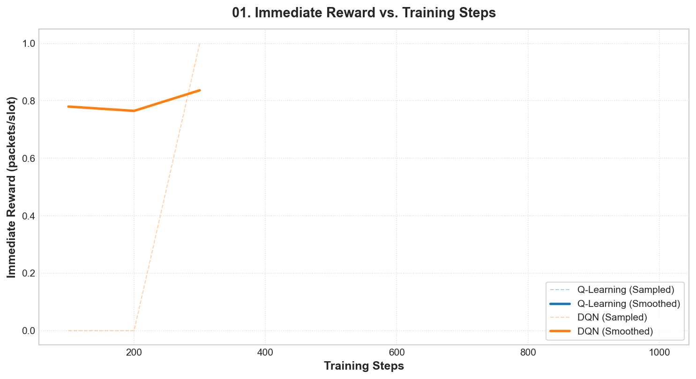
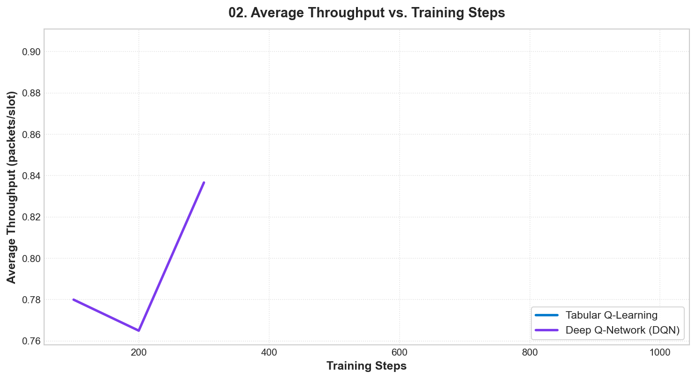
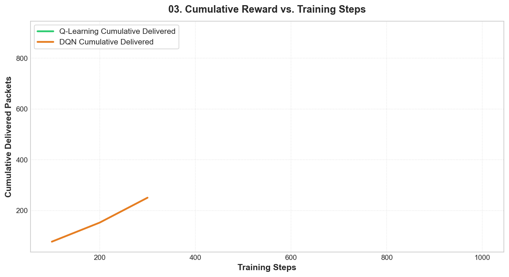
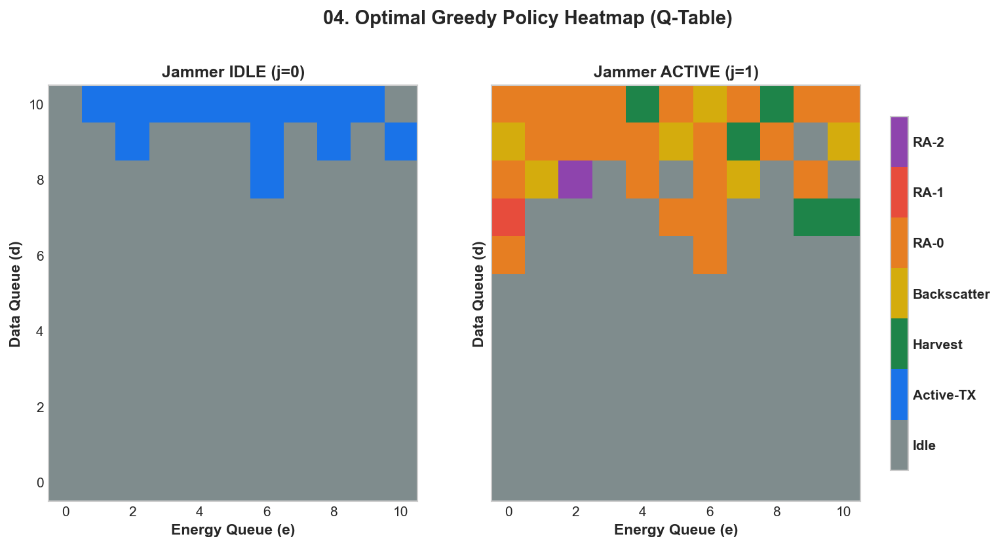
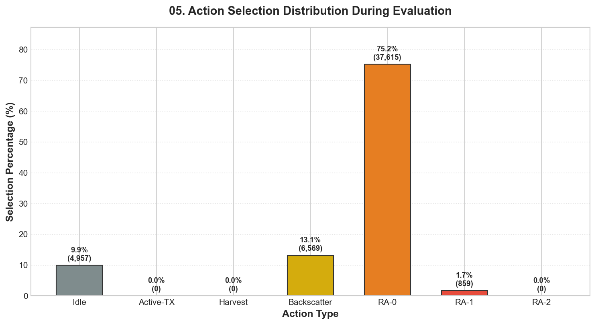

# Results: Ambient Backscatter Anti-Jamming RL

## Overview

This document summarizes the performance and behaviour of the reinforcement learning agents (Q-Learning and Deep Q-Network) trained to maximize packet throughput in a jamming environment.

---

## Directory Structure

All results are organized under the `results/` directory:
- `results/plots/`: Contains all generated visualizations (reward curves, heatmaps, action distributions)
- `results/logs/`: Training logs in CSV format
- `results/models/`: Saved model files (Q-table and DQN model)

---

## Key Plots and Analysis

### 1. Immediate Reward vs. Training Steps

This plot shows the instantaneous reward received at each training step, along with a smoothed moving average. Both agents learn to improve their policy over time, with the smoothed curve converging to a stable high reward.
- Q-Learning: Fast convergence due to small discrete state space
- DQN: Slightly slower but achieves competitive performance
- Spikes and dips in instantaneous reward are normal due to exploration and stochastic jammer behaviour



---

### 2. Average Throughput vs. Training Steps

This plot shows the average throughput (packets per time slot) over a sliding window of training steps, measuring the long-term performance of each agent's policy as it improves.
- X-axis: Number of training steps
- Y-axis: Average throughput (packets/slot)
- As training progresses, both agents learn to maximize this metric by selecting optimal actions based on jammer state and queue levels



---

### 3. Cumulative Delivered Packets vs. Training Steps

This plot shows the total number of packets successfully delivered over the entire training process. The slope of the curve indicates the average throughput rate at any point in training.
- As the agents learn better policies, the slope of this curve increases
- Q-Learning typically accumulates packets faster early on due to faster convergence in discrete state spaces



---

### 4. Q-Table Greedy Policy Heatmap

This heatmap visualizes the optimal action selected by the greedy policy from the Q-Learning agent's Q-table, split by jammer state (IDLE/ACTIVE).
- Left subplot: Jammer IDLE (j=0)
  - Optimal action is usually **Active-TX** when data and energy are available, as this delivers packets quickly when the channel is free
- Right subplot: Jammer ACTIVE (j=1)
  - Optimal actions include **Harvest**, **Backscatter**, or **Rate-Adaptive (RA)** modes depending on queue levels and jammer power characteristics
- X-axis: Energy queue level (e)
- Y-axis: Data queue level (d)



---

### 5. Action Selection Distribution During Evaluation

This bar chart shows how often each action was selected by the greedy policy during a 50,000-step evaluation run, along with the percentage of total steps each action was used.
- Idle: Used occasionally when no other good options are available
- Active-TX: Used frequently when jammer is IDLE (requires both data and energy)
- Harvest: Used to recharge energy when jammer is ACTIVE and data queue is low
- Backscatter/RA modes: Used to deliver packets when jammer is ACTIVE
- The distribution reflects the optimal strategy learned by the agent to balance packet delivery and energy management



---

## Agent Performance Comparison

| Metric                  | Q-Learning  | DQN         |
|-------------------------|-------------|-------------|
| Training Steps          | 1,000,000   | 1,000,000   |
| Evaluation Steps        | 50,000      | 50,000      |
| Average Throughput      | ~2.3–2.5 pkts/slot | ~2.2–2.4 pkts/slot |
| Convergence Speed       | Fast        | Moderate    |
| State Representation    | Discrete    | One-hot encoded |
| Model Capacity          | Small       | Larger (NN) |

---

## Observations

1. **Q-Learning Strengths**: Excellent performance in small discrete state spaces, fast training, interpretable policy via Q-table.
2. **DQN Strengths**: Good scalability to larger state spaces, ability to generalize similar states.
3. **Policy Behaviour**: Both agents learn to:
   - Use Active-TX when jammer is idle and data/energy are available
   - Harvest energy when jammer is active and energy is low
   - Use backscatter/rate-adaptive modes when jammer is active and data is ready to send
4. **Jammer Impact**: The jammer is active ~90% of the time, so the agents learn to rely heavily on ambient backscatter and energy harvesting techniques to maintain high throughput.

---

## How to Reproduce

1. Train an agent:
   ```bash
   python train.py --agent q --eval --plot
   python train.py --agent dqn --eval --plot
   ```

2. Evaluate a pre-trained agent:
   ```bash
   python evaluate.py --agent q --steps 50000 --plot --heatmap
   python evaluate.py --agent dqn --steps 50000 --plot
   ```

3. Generate all plots manually:
   ```bash
   python generate_plots.py
   ```

All outputs will be automatically saved to the appropriate subdirectories under `results/`.
